```mermaid
graph TB
  subgraph Physical["🌍 Physical Science"]
    ECS["ECS-12: Climate Sensitivity"]
    CBGT["CBGT-13: Carbon Budget"]
    MGCC["MGCC-14: MAGICC Pipeline"]
    METB["METB-19: Global Metabolism"]
    DECP["DECP-15: Decoupling Review"]
  end

  subgraph Economic["💰 Economic Models"]
    EEM["EEM-3: Earth-economy"]
    IEEM["IEEM-C: IEEM Platform"]
    GDCE["GDCE-E: GreenDICE"]
    MSPL["MSPL-9: MAgPIE-SEALS"]
    SCCL["SCCL-F: SCC Lineage"]
    SUCC["SUCC-18: SuCCESs IAM"]
  end

  subgraph Theoretical["🧠 Theoretical Framework"]
    RNCM["RNCM-B: Ramsey + NC"]
    IWTH["IWTH-15: Inclusive Wealth"]
    ACCT["ACCT-17: Accounting Spectrum"]
    SEST["SEST-17: SES-TFP Decomposition"]
    EEFB["EEFB-5: Feedback Loops"]
    NMTH["NMTH-16: Numerical Methods"]
  end

  subgraph Case["📋 Cases & Catalogs"]
    ECON["ECON-4: Economic Case for Nature"]
    SSPL["SSPL-D: SSP Land-use"]
    NBS["NBS-8: NBS Urban Catalog"]
    TIBT["TIBT-14: Tibetan Grazing"]
    ECOG["ECOG-16: EcoC-G ABM"]
  end

  subgraph Synthesis["🔗 Synthesis"]
    ECSF["ECSF-10: Climate-Social Feedback"]
    NCCA["NCCA-7: WAVES/GPS"]
    CGET["CGET-6: GTAP Alternatives"]
    CLSP["CLSP-11: Climate Pipeline"]
    STDY["STDY-19: STEADY/PASTOR/GRACe"]
    PHBL["PHBL-18: Philosophical Biology"]
  end

  %% Physical connections
  ECS --> CBGT
  CBGT --> MGCC
  METB --> DECP

  %% Theoretical → Economic
  RNCM --> EEM
  RNCM --> IEEM
  RNCM --> GDCE
  RNCM --> MSPL
  IWTH --> RNCM
  ACCT --> IWTH
  SEST --> EEM
  SEST --> GDCE

  %% Physical → Economic
  MGCC --> GDCE
  MGCC --> SCCL

  %% Economic → Cases
  EEM --> ECON
  EEM --> SSPL
  MSPL --> SSPL
  GDCE --> SCCL
  IEEM --> SCCL
  ECON --> SCCL

  %% Cases → Synthesis
  TIBT --> STDY
  ECOG --> STDY
  NBS --> NCCA
  SSPL --> CLSP
  ECS --> CLSP
  METB --> DECP

  %% Synthesis interlinks
  STDY --> IEEM
  STDY --> EEFB
  STDY --> RNCM
  STDY --> IWTH
  ECSF --> SSPL
  ECSF --> SCCL
  PHBL --> RNCM
  PHBL --> IWTH
  PHBL --> ACCT
  NCCA --> CGET
  SUCC --> CGET
  NMTH --> GDCE
  NMTH --> RNCM

  %% Feedback gaps identified
  IEEM -.->|"partial K_n closure"| RNCM
  MSPL -.->|"K_n gap identified"| RNCM
  EEM -.->|"open loop"| RNCM

  classDef phys fill:#f1f8e9,stroke:#558b2f
  classDef econ fill:#fff3e0,stroke:#f57c00
  classDef theory fill:#e1f5fe,stroke:#0288d1
  classDef case fill:#fce4ec,stroke:#c62828
  classDef synth fill:#f3e5f5,stroke:#7b1fa2

  class ECS,CBGT,MGCC,METB,DECP phys
  class EEM,IEEM,GDCE,MSPL,SCCL,SUCC econ
  class RNCM,IWTH,ACCT,SEST,EEFB,NMTH theory
  class ECON,SSPL,NBS,TIBT,ECOG case
  class ECSF,NCCA,CGET,CLSP,STDY,PHBL synth
```

# Knowledge Graph (v2.2 — full expanded)

> Mermaid concept-relationship graph — per CONSTITUTION.md Article VIII
> Reflects **knowledge/** (published) entries only.

---

---

## Architecture Summary

**31 entries** across 5 layers. Consolidation 2026-05-27 added 11 entries:
IWTH-15 (Inclusive Wealth), NMTH-16 (Numerical Methods), ACCT-17 (Accounting Spectrum), SEST-17 (SES-TFP), METB-19 (Global Metabolism), SUCC-18 (SuCCESs IAM), ECOG-16 (EcoC-G ABM), TIBT-14 (Tibetan Plateau), DECP-15 (Decoupling Review), STDY-19 (STEADY), PHBL-18 (Philosophical Biology).

Core intellectual chain: ECS→CBGT→MGCC→GDCE→SCCL (climate physics→SCC) + RNCM→IWTH→ACCT→SEST (theory→decomposition) + combined into STEADY (STDY-19).
